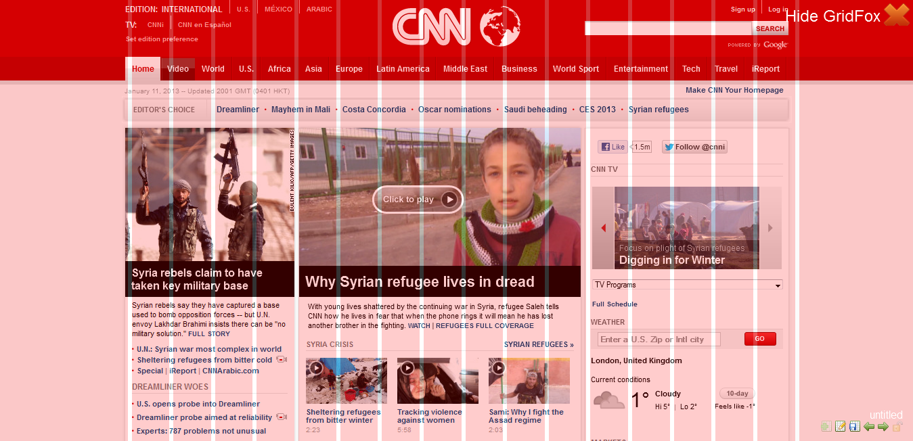
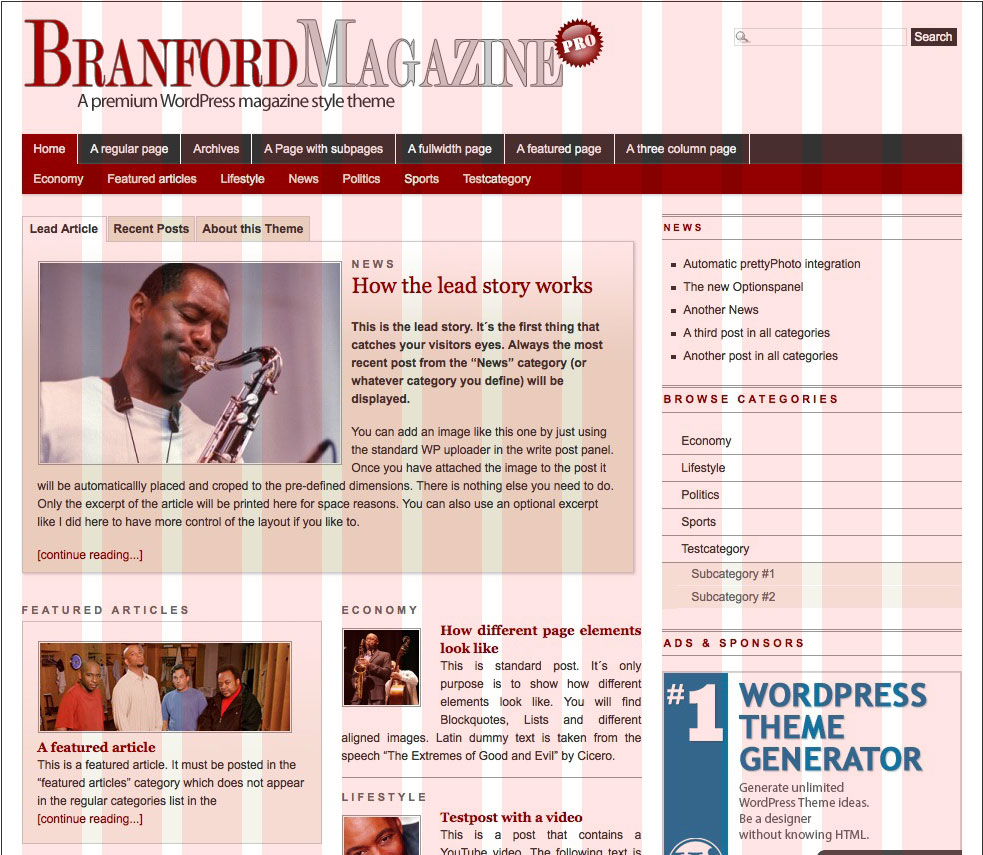
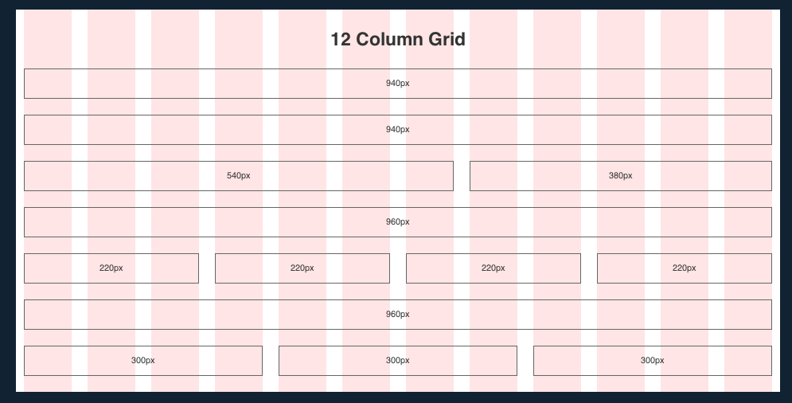

# Grids and Design Tools

---

## Agenda

* Grid Systems
* Writing Content
* Photographs
* Picking Colors
* Icons
* Fonts

---

## Grid Systems

A __grid system__ is a set of measurements a graphic designer can use to align and size objects a webpage.

Note:
Although there are a few different styles of grid systems, there are no strict rules on what can or cannot be a grid. It's up to you. Any guides that help you shape the final design is okay.

---

## CNN: 16 Column Grid

---

## Blog Example: 12 Column Grid

---

## 12 Column Grid

---

## CSS Frameworks

* Bootstrap (http://getbootstrap.com/)
* Foundation (http://foundation.zurb.com/)
* Bourbon Neat (http://neat.bourbon.io/)
* ... and more!

---

## Bootstrap

http://getbootstrap.com/

---

## Wireframe with Bootstrap

---

## Placeholder content

Lorem Ipsum is the steroetypical placeholder content.  

Use if you need to fill your page with content, but do not want to write it now.

http://www.lipsum.com/

---

## Fun Lorem Ipsum

* Bacon: http://baconipsum.com/
* Cupcakes: http://cupcakeipsum.com/
* Zombies: http://www.zombieipsum.com/
* Bob Ross: http://www.bobrosslipsum.com/
* Riker: http://www.rikeripsum.com/#!/

---

## Content Snippets

Actual (real) content for parts of site, taken from other sites.

http://www.contentsnippets.com/

---

## Stock photography

Things to know:

- There are a lot of stock photography sites online.
- Not all photographs online are free. (But some are!)
- Check the licenses for images you want to use.

---

## Photo license types

* __Commercial__: Used to sell or promote products.
* __Editorial__: Used for journalism or educational purposes.
* __Retail__: Photos that are taken or commissioned for client's personal use.

Note:
Source: http://www.diyphotography.net/photo-licensing-look-basics/

---

## Photo license usage

* __Royalty-free__: Nearly unlimited use once you purchase a license.  Can use for as long as you would like for nearly any application.
* __Rights-managed__: Usage is restricted by geography, time, or other uses. Outlined in the license agreement.

Note:
Source: http://www.stockphotorights.com/faq/

---

## Free stock photo sites

* Gratisography: http://www.gratisography.com/
* Pexels: https://www.pexels.com/
* Links to other sites: https://medium.com/@dustin/stock-photos-that-dont-suck-62ae4bcbe01b#.gkqtp5ddd

---

## Need a placeholder image in the meantime?

* http://placekitten.com/

---

## Fill in your wireframes with (fake) content

---

## Picking colors

There are a ton of color palette picks online:

* Paletton: http://paletton.com/
* Spectral: http://jxnblk.com/Spectral/

---

## Picking colors

There are also a random color scheme generators:

* https://coolors.co/app/

---

## Need icons?

Icon fonts are a great way to incorporate icons into your site

* Navigation
* Social Media
* Payment Methods

http://fortawesome.github.io/Font-Awesome/

---

## Speaking of fonts

Don't forget about Google Fonts!

https://www.google.com/fonts

---

## Let's start designing

---

## Need Design Inspiration?

* Uxplore: http://uxplore.francescobalducci.com/
* Behance: https://www.behance.net/search?field=102&content=projects&sort=appreciations&time=week
* Flat Design: http://creativepro.com/36-amazing-examples-of-flat-design/
* Thinking about responsive: http://mediaqueri.es/popular/
