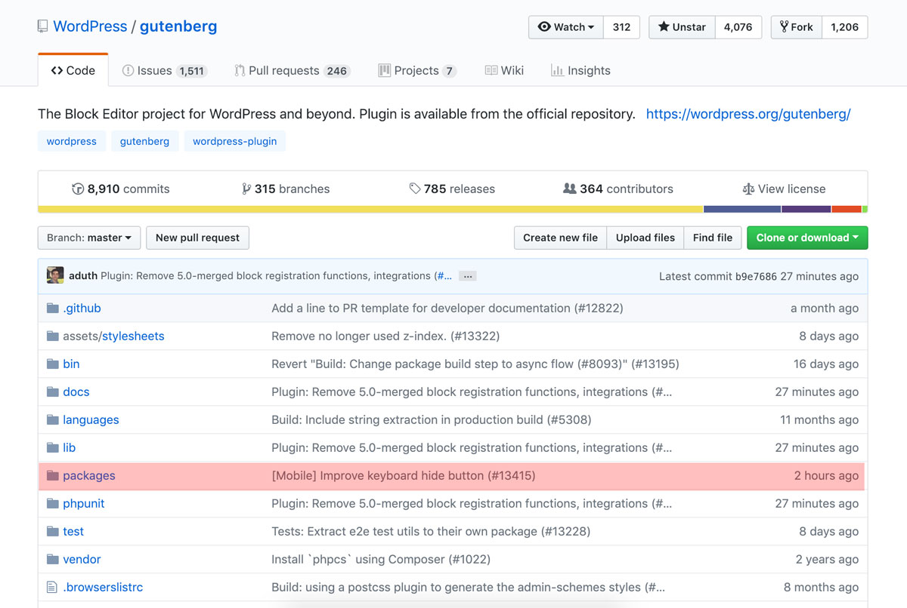
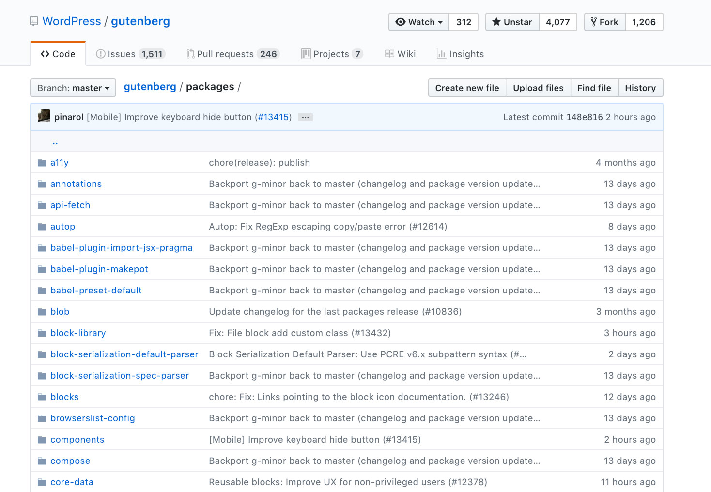

# Customizing Gutenberg
## Lessons learned at Georgetown

---

# Hello! My name is Joni.

* DC-based developer (via NJ, NY, and MA)
* __Historically:__ Developer @ lots of small businesses
* __Currently:__ Javascript front-end dev @ Georgetown
* Find me [@jonihalabi](https://twitter.com/jonihalabi)

---

# @GU Web Services

* Small team of PMs, designers, & devs
* Manage (almost) all department websites (300+!)

---

# Our Set Up

* 300+ websites in a multisite Drupal 7 env.
* Sites use 1 of 3 themes
  * Schools
  * Departments (units)
  * Top tier (www.g.e) has a unique theme

---

# Our Dilemma

* Site themes are getting stale
* Just launched new D7 themes, but....
* D7 end of life is coming!

---

# We need to upgrade!

## Drupal 8? Or... what about WordPress?

---

<section class="full-screen-img" data-background-image="images/technical_analysis_2x.png" data-background-size="contain"></section>

---

# And the winner is... Wordpress!

* Easier admin UI
* Easier to maintain
* Gutenberg is new and exciting

---

# Content Goals

* Make full use of Gutenberg
* Make sure all blocks are accessible

---

# Step 1
## Get to know the editor

---

<section data-background-image="images/editor-annotated.jpg" data-background-size="contain" data-background-color="#fff"></section>

---

# Block

A single element in the UI.

---

# Toolbar
Each block can have a UI toolbar that appears above the block in the editor. It can include things like font options, alignment, and more.

---

# Inspector panel
## (Also called the block panel)

The panel that appears to the right of the editor when a block is active.

---

# The editor comes with core blocks
(Can be selected from the Block Selector)

---

<section data-background-image="images/block-selector.jpg" data-background-size="contain" data-background-color="#fff"></section>

---

# Step 2
## Do these core blocks cover all of our needs?

---

# Content Audit

* Blocks we can use
* Blocks we can't use (#a11y)
* Blocks we need but don't exist

---

# TODO: Insert examples of custom blocks we need (i.e. card decks)

---

# Step 3
## Create custom blocks

* Worked off of the (large!) list of "blocks we need but don't exist".

---

<section data-background-image="images/lets-get-started.jpg" data-background-size="contain" data-background-color="#fff"></section>

---

# Development

* We started in early 2018... and we're still going.
* We were working with a moving target.

---

# Lesson 1
## Know React.js before you start

---

# Gutenberg is:

* ... based on React
* ... but you're really dealing with its API

---

# Creating a new block is easy!

* You still need a little bit of PHP.
* But, most of the work is in the JS.

---

# The PHP

```
function gu_hello() {
  $blockJsPath = 'build/block.min.js';

  wp_enqueue_script(
    'gu-hello-block',
    plugins_url( $blockJsPath, __FILE__ ),
    array( 'wp-blocks', 'wp-components' ),
    filemtime( plugin_dir_path( __FILE__ ) . $blockJsPath )
  );

}

add_action( 'enqueue_block_editor_assets', 'gu_hello' );
```

---

# The Javascript

```
registerBlockType( 'gu/hello-world', {
  title: 'Hello World',
  description: 'Use this block to say hello.',
  category: 'common',
  icon: 'admin-home',

  attributes: { ... },

  edit: ( props ) => { ... },

  save: ( props ) => { ... },

});
```

---

# Title

This is the title of the block, which appears in the block selector. It is best to keep this short.

---

# Description

This is a short description of the block, which appears in the inspector panel, just below the title, when the block is active in the edit screen.

---

# Category

Blocks in the block selector are organized by category. You can create your own categories, but there are OOTB ones:

* Inline elements
* Common blocks
* Formatting
* Layout elements
* Widgets
* Embeds

---

# Icon

The icon that appears in the block selector for the block. This can be a Dashicon or a custom SVG.

---

# Keywords

Like SEO keywords, these are search terms that an editor may use to find the block in the block selector.

* The selector search box can already find blocks by words from the block title
* Ideally the keywords should be different
* Hard limit of 3

---

# Attributes

The data saved for the block.

---

```
attributes: {
  name: { default: '' }
}
```

---

# Edit function

The UI displayed in the block editor.

---

```
edit: ( props ) => {
  const { name } = props.attributes;

  const onChangeName = ( value ) => {
    setAttributes( { name: value } )
  };

  return (
    <h1>Hello

      <TextControl
        tagname='span'
        placeholder='Add your name'
        value={ name }
        onChange={ onChangeName } />
    </h1>
  );
}
```

---

# Save function

The UI displayed on the front-end.

---

```
save: ( props ) => {
  // Get the attribute values needed from props.
  const { name } = props.attributes;

  // Return the front-end HTML.
  return (
    <h1>Hello { name }</h1>
  );
}
```

---

# Lesson 2
## The Gutenberg API is your new BFF

---

# Gutenberg Github

* Everything is divided into packages.
* Some central documentation
* But, most documentation is within each package.
* You need to know where to look.

---



---



---

# Packages for new block dev:

* `/packages/blocks`
* `/packages/components`
* `/packages/editor`

---

# Components

* UI elements that can be added to a custom block.
* There are two different lists of components:
  * general UI components (`/packages/components`)
  * editor components (`/packages/editor`)
* I have no idea why they are separated out. We are using components from both buckets.

---

# Core block code

* `/packages/block-library`
* Very useful to see real world examples of how components are used.

---

# TODO: Talk about documentation folder in Gutenberg github

---

# TODO: Talk about fancy stuff like nested blocks

---

# Lesson 3
## Know what you want

(or be willing to play around)

---

### We didn't exactly know what we wanted

(even when we thought we did)

* What do we need from the admin UI?
* So. Many. Options.
* So, design and design and design _(#agile)_
* Real users helped a lot! _(#uxtesting)_

---

# Lesson 4
## Code architecture is really important

---

# Our custom blocks:

* Were contained in their own custom plugin from the start
* But we underestimated how many new blocks we needed

---

# We started so early!

* Everything was changing
* Gutenberg was still in beta, so
* Our code broke all. the. time.

---

# Our code === Frankenstein’s monster.

We could have spent some more time:

* Architecting the plugin to compile a single JS file.
* Finding a better way to organize files.
* This will be done in a phase 2 of the plugin _(#technicaldebt)_

---

# Lessons Summary

* Life will be much easier if you know React
* Get to know the Gutenberg Github repo very well.
* Architect. Architect. Architect.
* Breathe.

---

# Thank you!!

---

# Resources

* [Gutenberg project Github](https://github.com/WordPress/gutenberg)
* [Documentation about creating new blocks](https://github.com/WordPress/gutenberg/tree/master/packages/blocks)
* [Zac Gordon's Gutenberg Block Development Course](https://javascriptforwp.com/product/gutenberg-block-development-course/)
